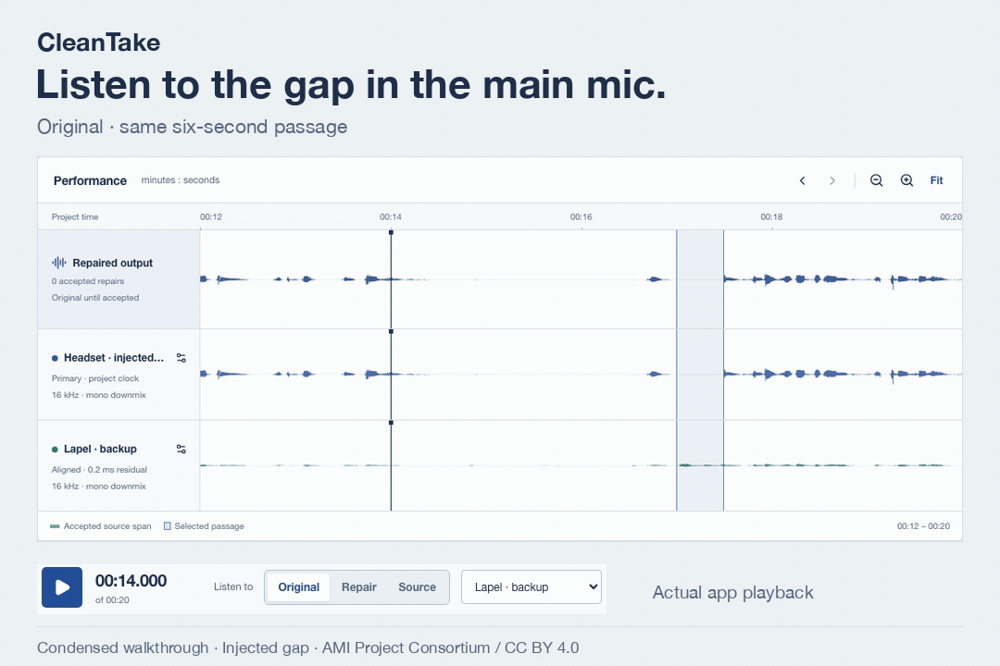

# CleanTake

**Your backup microphone might have the word you lost.**

CleanTake recovers damaged dialogue from simultaneous recordings. Align a main
mic with its backups, compare a suggested repair at the same moment, and keep
the source of every replacement visible through the final export.

[](https://github.com/pavangupta352/cleantake/actions/workflows/ci.yml)
[](LICENSE)

**[Download the desktop app](https://github.com/pavangupta352/cleantake/releases/tag/v0.2.1)** · [Hear a repair](#hear-one-repair) · [Editing guide](docs/GUIDE.md)

<a href="https://pavangupta352.github.io/cleantake/#demo">
  <picture>
    <source media="(prefers-reduced-motion: reduce)" srcset="docs/assets/working-demo/still.png">
    
  </picture>
</a>

**[Watch with sound · 22 seconds](https://pavangupta352.github.io/cleantake/#demo)**
· [Static image](docs/assets/working-demo/still.png)
· [Media credits](docs/assets/working-demo/ATTRIBUTION.md)

A condensed recording of the working app. The sample deliberately introduces a
half-second gap; the lapel captured the replacement. Audio: AMI Project Consortium,
CC BY 4.0.

Open CleanTake as a desktop app on Mac, Windows or Linux. Your recordings stay
on your computer. The app includes its processing tools and an offline sample;
there is no account or cloud upload.

## Hear one repair

**[Watch the original 18-second comparison](https://pavangupta352.github.io/cleantake/assets/launch/cleantake-comparison.mp4)**
· [Video credits](docs/assets/launch/ATTRIBUTION.md)

**[Before: a half-second gap](https://raw.githubusercontent.com/pavangupta352/cleantake/main/docs/assets/demo/before.wav)**
· **[After: speech from the lapel](https://raw.githubusercontent.com/pavangupta352/cleantake/main/docs/assets/demo/after.wav)**

The gap is three seconds into these six-second clips. Two real microphones
recorded the same speaker. A script removed 0.5 seconds from the headset, ran
analysis, and explicitly accepted the resulting lapel proposal without changing
its alignment, bounds, gain or crossfade. The rest of the primary is preserved
before PCM24 rounding. No loudness finishing was applied.

This is controlled damage on an AMI development excerpt, not an organic failure
or a listening-quality benchmark. The recordings are CC BY 4.0, credited to the
AMI Project Consortium. [Attribution and modifications](docs/assets/demo/ATTRIBUTION.md)
· [Decision and hashes](docs/assets/demo/manifest.json)
· [Actual source map](docs/assets/demo/source-map.json)

## Download and try it

**[Download CleanTake 0.2.1](https://github.com/pavangupta352/cleantake/releases/tag/v0.2.1)**

| Computer | Download |
|---|---|
| Mac · Apple silicon | [Apple silicon DMG](https://github.com/pavangupta352/cleantake/releases/download/v0.2.1/CleanTake-0.2.1-mac-arm64.dmg) |
| Mac · Intel | [Intel DMG](https://github.com/pavangupta352/cleantake/releases/download/v0.2.1/CleanTake-0.2.1-mac-x64.dmg) |
| Windows · Intel / AMD | [Windows installer](https://github.com/pavangupta352/cleantake/releases/download/v0.2.1/CleanTake-0.2.1-win-x64.exe) |
| Windows · ARM | [Windows ARM installer](https://github.com/pavangupta352/cleantake/releases/download/v0.2.1/CleanTake-0.2.1-win-arm64.exe) |
| Ubuntu desktop · Intel / AMD | [Debian package](https://github.com/pavangupta352/cleantake/releases/download/v0.2.1/CleanTake-0.2.1-linux-amd64.deb) |
| Ubuntu desktop · ARM | [ARM Debian package](https://github.com/pavangupta352/cleantake/releases/download/v0.2.1/CleanTake-0.2.1-linux-arm64.deb) |

Install the matching download and open CleanTake. No separate Python, FFmpeg,
browser, model or GPU computing driver is required. Linux's package manager
resolves any required operating-system desktop libraries.

**Publisher trust:** these macOS builds are ad-hoc signed and are not notarized;
the Windows installers are unsigned. macOS can block first launch; Windows can show a publisher warning or block
unsigned apps under Smart App Control or managed policies. See the [desktop guide](docs/DESKTOP.md) for the
actual platform scope and signing status before downloading.

The first launch opens a workspace with **Sample · recover a missing half-second**.
Open the sample, select the passage near 17 seconds, and compare **Original**
with **Source**. Choose **Accept repair**, listen in **Repair** mode, then export.
The included sample works offline and leaves the choice to you.

[Desktop installation](docs/DESKTOP.md) · [Editing guide](docs/GUIDE.md)
· [CLI / browser installation](docs/INSTALLATION.md#command-line-and-browser-edition)
· [Reproduce the sample](examples/README.md)

Trying CleanTake for the first time? The [first-try guide](docs/FIRST-TRY.md)
walks through comparing, editing, saving and reopening the sample, with a short
list of feedback that helps improve the next release.

## The complete recovery desk

| Step | What you can do |
|---|---|
| Import | Add two to four simultaneous audio or video recordings; select streams and channels; keep immutable originals |
| Align | Estimate offset, drift and polarity; inspect uncertainty; set a manual clock when needed |
| Review | See actual waveforms, compare at a shared time, inspect proposals and choose the donor |
| Repair | Edit bounds, gain and crossfade; create manual repairs; accept, reject, undo and redo |
| Navigate | Import transcript context with preserved word timestamps and explicit estimated timing |
| Deliver | Export WAV/FLAC, aligned stems, an editable Reaper session, a source map and portable projects |

Each accepted repair replaces a bounded interval with audio from an actual
recording. The source map records identities, hashes, clock transforms and both
contributors to every crossfade. Reaper exports retain editable volume envelopes
for the same source choices. Optional finishing writes a separate, measured
loudness-normalized file while preserving the unmastered mix.

[Export formats and provenance](docs/EXPORTS.md)
· [API](docs/API.md)
· [Transcript integration with turnchunk](docs/TRANSCRIPTS.md)

## Use the command line

Install the optional [command-line edition](docs/INSTALLATION.md#command-line-and-browser-edition)
for shell commands and unattended workflows.

```sh
cleantake repair main.wav lapel.wav camera.mov --output review-export
```

This creates a saved project, aligns the recordings and exports its current
decisions. **Suggestions stay pending by default.** Open the same workspace in
the studio to review them. To explicitly accept suggestions at a chosen evidence
score in an unattended workflow:

```sh
cleantake repair main.wav backup.wav --output accepted-export \
  --accept-confident --min-confidence 0.9
```

The score is not a probability of audible quality. Outputs report accepted,
pending and unresolved counts. Existing output directories are never overwritten.
`cleantake --help` lists project, source, repair, history and archive commands.

## Know the limits

Automatic detection can miss damage, especially when microphones hear very
different rooms or share little clear speech. Manual repair is part of the
workflow. Listen for changes in tone and room sound at every source switch.

Uncertain sources cannot become accepted replacements until aligned. When every
recording lost a word, CleanTake has no recorded replacement. It leaves that
case unresolved. It does not automatically shorten pauses, remove fillers,
erase laughter or cut overlapping speakers. Noise alone does not trigger a
claim that a backup is better.

The current output timeline is **48 kHz mono**. Inputs may be multichannel;
select a channel or downmix on import. The desktop edition includes its FFmpeg
build; the CLI/browser edition uses the FFmpeg installed on your system.
Self-contained recordings are supported; media playlists are not.

The [evaluation report](docs/EVALUATION.md) includes fixed-clock tests,
untuned meeting excerpts, missed proposals and long-session measurements.
Independent listening preference, organic damage coverage and editor-time
advantage have not been established.

## Develop and contribute

```sh
git clone https://github.com/pavangupta352/cleantake.git
cd cleantake
uv sync --locked
uv run pytest
uv run cleantake studio
```

CleanTake separates the numerical engine, versioned projects, exports, local API
and browser studio. Small reproducible recordings and exact failure reports are
especially useful contributions.

[Contributing](CONTRIBUTING.md) · [Architecture](docs/ARCHITECTURE.md)
· [Design](DESIGN.md) · [Roadmap](docs/ROADMAP.md) · [Security](SECURITY.md)

Maintained by [Pavan Gupta](https://github.com/pavangupta352).
Code: [MIT](LICENSE). Bundled recordings and dependencies retain their
[third-party licenses](THIRD_PARTY_NOTICES.md).
