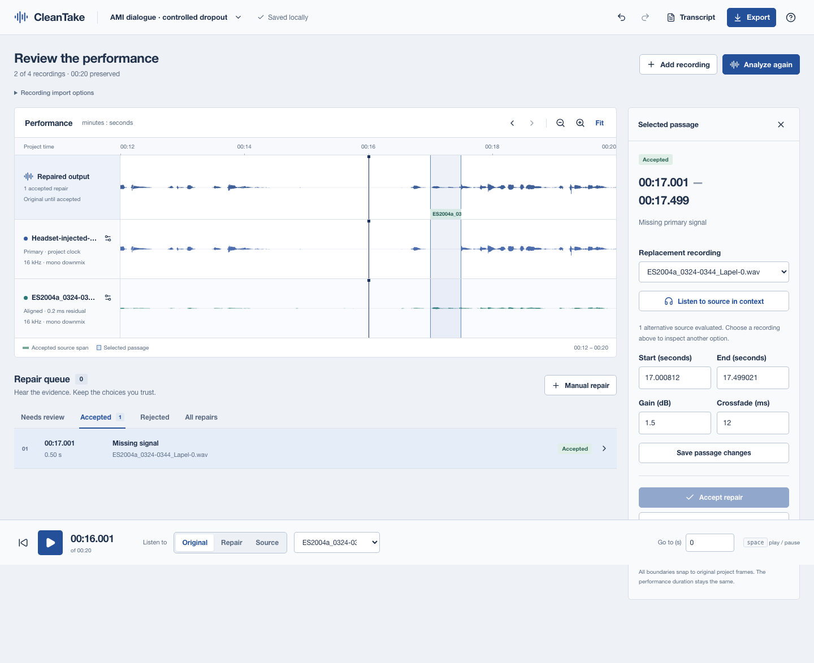

# CleanTake

**Your backup microphone might have the word you lost.**

CleanTake recovers damaged dialogue from simultaneous recordings. Align a main
mic with its backups, compare a suggested repair at the same moment, and keep
the source of every replacement visible through the final export.

[](https://github.com/pavangupta352/cleantake/actions/workflows/ci.yml)
[](LICENSE)



The studio runs locally in your browser. Your files stay on your computer.
There is no account, paid processing service or cloud upload.

## Hear one repair

**[Before: a half-second gap](https://raw.githubusercontent.com/pavangupta352/cleantake/main/docs/assets/demo/before.wav)**
· **[After: speech from the lapel](https://raw.githubusercontent.com/pavangupta352/cleantake/main/docs/assets/demo/after.wav)**

The gap is three seconds into these six-second clips. Two real microphones
recorded the same speaker. A script removed 0.5 seconds from the headset, ran
analysis, and explicitly accepted the resulting lapel proposal without changing
its alignment, bounds, gain or crossfade. The rest of the primary is preserved
before PCM24 rounding. No loudness finishing was applied.

This is controlled damage on an AMI development excerpt, not an organic failure
or a listening-quality benchmark. The recordings are CC BY 4.0, credited to the
AMI Project Consortium. [Attribution and modifications](docs/assets/demo/ATTRIBUTION.md)
· [Decision and hashes](docs/assets/demo/manifest.json)
· [Actual source map](docs/assets/demo/source-map.json)

## Try it

Install FFmpeg, then download the wheel from
[the latest release](https://github.com/pavangupta352/cleantake/releases/latest).
With [uv](https://docs.astral.sh/uv/getting-started/installation/):

```sh
uv tool install --python 3.12 ./cleantake-0.1.0-py3-none-any.whl
cleantake doctor
cleantake demo
cleantake studio
```

Open the sample project, select the passage near 17 seconds, and compare
**Original**, **Repair** and **Source**. Accept it when you're satisfied, then
export. The sample works offline and leaves the choice to you.

Python 3.12+ and FFmpeg/FFprobe are required. The wheel includes the studio and
sample audio; using it does not require Node.js.
[Installation and troubleshooting](docs/INSTALLATION.md)
· [Editing guide](docs/GUIDE.md)
· [Reproduce the sample](examples/README.md)

## The complete recovery desk

| Step | What you can do |
|---|---|
| Import | Add two to four simultaneous audio or video recordings; select streams and channels; keep immutable originals |
| Align | Estimate offset, drift and polarity; inspect uncertainty; set a manual clock when needed |
| Review | See actual waveforms, compare at a shared time, inspect proposals and choose the donor |
| Repair | Edit bounds, gain and crossfade; create manual repairs; accept, reject, undo and redo |
| Navigate | Import transcript context with preserved word timestamps and explicit estimated timing |
| Deliver | Export WAV/FLAC, aligned stems, an editable Reaper session, a source map and portable projects |

Each accepted repair replaces a bounded interval with audio from an actual
recording. The source map records identities, hashes, clock transforms and both
contributors to every crossfade. Reaper exports retain editable volume envelopes
for the same source choices. Optional finishing writes a separate, measured
loudness-normalized file while preserving the unmastered mix.

[Export formats and provenance](docs/EXPORTS.md)
· [API](docs/API.md)
· [Transcript integration with turnchunk](docs/TRANSCRIPTS.md)

## Use the command line

```sh
cleantake repair main.wav lapel.wav camera.mov --output review-export
```

This creates a saved project, aligns the recordings and exports its current
decisions. **Suggestions stay pending by default.** Open the same workspace in
the studio to review them. To explicitly accept suggestions at a chosen evidence
score in an unattended workflow:

```sh
cleantake repair main.wav backup.wav --output accepted-export \
  --accept-confident --min-confidence 0.9
```

The score is not a probability of audible quality. Outputs report accepted,
pending and unresolved counts. Existing output directories are never overwritten.
`cleantake --help` lists project, source, repair, history and archive commands.

## Know the limits

Automatic detection can miss damage, especially when microphones hear very
different rooms or share little clear speech. Manual repair is part of the
workflow. Listen for changes in tone and room sound at every source switch.

Uncertain sources cannot become accepted replacements until aligned. When every
recording lost a word, CleanTake has no recorded replacement. It leaves that
case unresolved. It does not automatically shorten pauses, remove fillers,
erase laughter or cut overlapping speakers. Noise alone does not trigger a
claim that a backup is better.

The current output timeline is **48 kHz mono**. Inputs may be multichannel;
select a channel or downmix on import. Compressed formats depend on the installed
FFmpeg build. Self-contained recordings are supported; media playlists are not.

The [evaluation report](docs/EVALUATION.md) includes fixed-clock tests,
untuned meeting excerpts, missed proposals and long-session measurements.
Independent listening preference, organic damage coverage and editor-time
advantage have not been established. The first public release includes the full
workflow; these claims remain open for evidence.

## Develop and contribute

```sh
git clone https://github.com/pavangupta352/cleantake.git
cd cleantake
uv sync --locked
uv run pytest
uv run cleantake studio
```

CleanTake separates the numerical engine, versioned projects, exports, local API
and browser studio. Small reproducible recordings and exact failure reports are
especially useful contributions.

[Contributing](CONTRIBUTING.md) · [Architecture](docs/ARCHITECTURE.md)
· [Design](DESIGN.md) · [Roadmap](docs/ROADMAP.md) · [Security](SECURITY.md)

Maintained by [Pavan Gupta](https://github.com/pavangupta352).
Code: [MIT](LICENSE). Bundled recordings and dependencies retain their
[third-party licenses](THIRD_PARTY_NOTICES.md).
